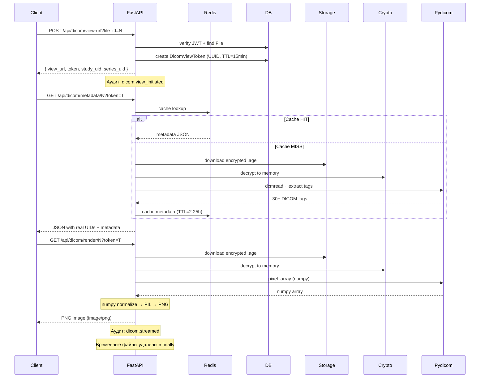

# Architecture Document — Secure Medical Data Gateway (SMDG)

**Версия:** 1.0  
**Дата:** 06 апреля 2026

---

## 1. Обзор архитектуры

SMDG — self-hosted решение для безопасной передачи медицинских данных.  
Архитектура построена по принципам **Zero Trust**, layered design и полной контейнеризации.

**Ключевые принципы:**
- Максимальная конфиденциальность и целостность медицинских данных
- Полный аудит всех операций
- Соответствие ФЗ-152 и GDPR-подобным стандартам
- Асинхронность и высокая производительность
- Готовность к продакшену (secrets, healthchecks, monitoring)

---

## 2. Высокоуровневая архитектура

```mermaid
graph TD
    subgraph Client
        A[Веб-интерфейс (HTML + Vanilla JS)]
    end
    subgraph "Nginx Reverse Proxy"
        B[HTTPS + TLS 1.3 + HSTS]
    end
    subgraph "SMDG Application (FastAPI)"
        C[API Layer]
        D[Middleware: Audit + Rate Limit + User Context]
        E[Lifespan Events]
    end
    subgraph "Core Services"
        F[PostgreSQL]
        G[Redis]
        H[ClamAV]
    end
    subgraph "Storage & Crypto"
        I[Encrypted Files (/encrypted)]
        J[Age Encryption]
        K[Temporary Decrypted Files (/decrypted)]
    end

    A --> B --> C
    C --> D
    C --> E
    C --> F & G & H
    C --> I
    C <--> J
    C --> K

## 3. Схема базы данных (ERD)
erDiagram
    USER ||--o{ FILE : "owns"
    USER ||--o{ FILE_LINK : "creates"
    FILE ||--o{ FILE_LINK : "referenced_by"
    USER ||--o{ DICOM_VIEW_TOKEN : "creates"
    FILE ||--o{ DICOM_VIEW_TOKEN : "referenced_by"

    USER {
        int id PK
        string username
        string email
        string hashed_password
        string role
        boolean is_active
        string otp_secret
        timestamp created_at
        timestamp updated_at
    }

    FILE {
        int id PK
        string original_name
        string encrypted_name
        string encrypted_path
        bigint original_size
        bigint encrypted_size
        string original_hash
        string mime_type
        string patient_id
        jsonb medical_metadata
        int user_id FK
        timestamp uploaded_at
        timestamp expires_at
    }

    FILE_LINK {
        int id PK
        string token UK
        int file_id FK
        int max_downloads
        int downloads_count
        timestamp expires_at
        timestamp created_at
    }

    DICOM_VIEW_TOKEN {
        int id PK
        string token UK
        int file_id FK
        int user_id FK
        boolean used
        timestamp expires_at
        timestamp created_at
    }

Индексы:

user.username, user.email (unique)
file.owner_id, file.patient_id
file_link.token (unique + index)

## 4. Модели БД
User (app/models/user.py)
    id, username, email, hashed_password, role (user/doctor/admin), is_active, otp_secret

File (app/models/file.py)
    original_name, encrypted_name, encrypted_path, original_size, encrypted_size,
    original_hash, mime_type, patient_id, medical_metadata (JSONB), user_id,
    uploaded_at, expires_at

FileLink (app/models/file_link.py)
    token (UUID), file_id, max_downloads, downloads_count, expires_at

DicomViewToken (app/models/dicom_view_token.py)
    token (UUID), file_id, user_id, expires_at, created_at

## 5. Ключевые сценарии (Sequence Diagrams)
### 5.1. Upload файла
sequenceDiagram
    participant Client
    participant Nginx
    participant FastAPI
    participant ClamAV
    participant Crypto
    participant DB
    participant Storage

    Client->>Nginx: POST /api/upload
    Nginx->>FastAPI: Request + file
    FastAPI->>FastAPI: Rate Limit + Auth
    FastAPI->>ClamAV: instream(file)
    ClamAV-->>FastAPI: CLEAN / FOUND
    alt Virus detected
        FastAPI-->>Client: 400 Virus detected
    else Clean
        FastAPI->>Crypto: encrypt_file()
        Crypto->>Storage: save .age
        FastAPI->>DB: create File + FileLink
        DB-->>FastAPI: OK
        FastAPI-->>Client: 200 + download_url
    end

### 5.2. Download по токену

sequenceDiagram
    participant Client
    participant FastAPI
    participant DB
    participant Storage
    participant Crypto

    Client->>FastAPI: GET /api/download?token=xxx
    FastAPI->>DB: find FileLink by token
    alt Token valid
        DB-->>FastAPI: File record
        FastAPI->>Storage: get encrypted file
        FastAPI->>Crypto: decrypt_file()
        Crypto-->>FastAPI: decrypted bytes
        
        Note over FastAPI,DB: Критический участок — гарантия "at-least-once"
        FastAPI->>DB: increment downloads_count<br/>и/или delete link (если лимит исчерпан)
        FastAPI->>DB: commit
        
        FastAPI-->>Client: FileResponse (streaming)
        FastAPI->>Background: delete temporary file (after response)
        
        Note right of FastAPI: Даже если клиент оборвёт соединение<br/>после начала скачивания — токен уже считается использованным.
    else Invalid/Expired
        FastAPI-->>Client: 404 / 410
    end

### 5.3. Login с 2FA

sequenceDiagram
    participant Client
    participant FastAPI
    participant DB
    participant OTP

    Client->>FastAPI: POST /api/auth/login
    FastAPI->>DB: find User by username
    alt 2FA enabled
        FastAPI->>OTP: TOTP.verify(otp_code)
        OTP-->>FastAPI: True/False
    end
    FastAPI->>FastAPI: create JWT
    FastAPI-->>Client: 200 + set-cookie access_token

## 6. Lifespan Events (main.py)
При старте приложения (@asynccontextmanager lifespan) выполняются следующие шаги:

Чтение Docker Secrets (JWT, ADMIN_PASSWORD, DATABASE_URL)
Проверка и создание приватного ключа age.key
Ожидание готовности PostgreSQL (port 5432)
Применение Alembic-миграций
Инициализация FileStorageManager
Запуск фоновой задачи очистки (cleanup_manager.start_cleanup_task())
Создание/обновление администратора
Проверка необходимости ротации ключей
Генерация self-signed сертификата для localhost (dev-режим)


## 7. Технические решения и обоснования

Решение                 Почему выбрано
age encryption          Простой, надёжный, современный стандарт
FastAPI + Async         Высокая производительность и удобство
APScheduler             Простота, не требует RabbitMQ/Celery
Docker Secrets          Соответствие лучшим практикам безопасности
SQLModel + Alembic      Типизация + удобные миграции

## 8. Мониторинг и Prometheus-метрики
SMDG экспонирует метрики по адресу GET /metrics через библиотеку prometheus-fastapi-instrumentator.

Основные группы метрик

Метрика                        Тип                     Описание
http_requests_total            Counter                 "Общее количество HTTP-запросов (по методу, пути, статусу)"
http_request_duration_seconds  Histogram               "Время обработки запроса (buckets: 0.1, 0.5, 1, 5, 10 сек)"
http_requests_in_progress      Gauge                   "Количество одновременно обрабатываемых запросов"
upload_file_size_bytes         Histogram               "Размер загружаемых файлов (используется в /api/upload)"
upload_success_total           Counter                 "Количество успешно загруженных и зашифрованных файлов"
upload_virus_detected_total    Counter                 "Количество файлов, отклонённых ClamAV"
download_success_total         Counter                 "Количество успешных скачиваний по токену"
file_cleanup_deleted_total     Counter                 "Количество файлов, удалённых CleanupManager"
age_key_rotation_total         Counter                 "Количество выполненных ротаций ключей шифрования"
db_query_duration_seconds      Histogram               "Время выполнения SQL-запросов"
clamav_scan_duration_seconds   Histogram               "Время сканирования файла ClamAV"
rate_limit_exceeded_total      Counter                 "Количество превышений rate limit"

Метрики доступны в формате Prometheus и могут быть подключены к Grafana / Prometheus / Alertmanager.
Пример запроса:
curl -k https://localhost/metrics

## 9. Архитектура хранилища (Storage Backend)

### 9.1 Обзор

SMDG v2.0 поддерживает **гибридное хранилище** — абстракцию `StorageBackend` которая позволяет переключаться между локальной файловой системой и S3-совместимыми хранилищами **без изменения кода приложения**.

### 9.2 Компоненты

```
StorageBackend (ABC)
├── upload(key, file_path, content_type) → ObjectMetadata
├── download(key, destination_path) → Path
├── download_bytes(key) → bytes
├── delete(key) → bool
├── delete_many(keys) → Dict
├── exists(key) → bool
├── stat(key) → ObjectMetadata
├── list_objects(prefix) → List[ObjectMetadata]
└── get_storage_stats() → Dict
```

### 9.3 Реализации

| Класс                 | Описание              | Когда использовать                       |
|-----------------------|-----------------------|------------------------------------------|
| `LocalStorageBackend` | Обёртка над `pathlib` | Dev, small deployments, isolated servers |
| `S3StorageBackend`    | aiobotocore клиент    | Production, cloud, scalability           |

### 9.4 StorageFactory

Фабрика автоматически выбирает бэкенд на основе конфигурации:

```python
encrypted_storage = StorageFactory.create_backend(
    s3_enabled=settings.s3_enabled,
    s3_endpoint_url=settings.s3_endpoint_url,
    s3_access_key=settings.s3_access_key,
    s3_secret_key=settings.s3_secret_key,
    s3_bucket=settings.s3_bucket_encrypted,
    local_base_dir=ENCRYPTED_DIR,
)
```

### 9.5 Поток данных (Upload)

```
Client → Upload API → ClamAV → age Encrypt → StorageBackend.upload() → Storage
                                                          │
                                    ┌─────────────────────┴─────────────────────┐
                                    │                                           │
                            Local FS                                      S3/MinIO
                       /app/encrypted/                           smdg-encrypted bucket
                       encrypted_path = key                      encrypted_path = object_key
```

### 9.6 Поток данных (Download)

```
Client ← FileResponse ← age Decrypt ← StorageBackend.download() ← Storage
                               │
                    DECRYPTED_DIR (temp)
                    TTL-based auto-cleanup
```

### 9.7 Поддерживаемые S3-провайдеры

| Провайдер              | Endpoint                                    | SSL | ФЗ-152            |
|------------------------|---------------------------------------------|-----|-------------------|
| MinIO (self-hosted)    | `http://minio:9000`                         | Нет | ✅ (свой сервер)  |
| Yandex Object Storage  | `https://storage.yandexcloud.net`           | Да  | ✅                |
| Selectel Cloud Storage | `https://s3.selcdn.ru`                      | Да  | ✅                |
| AWS S3                 | `https://s3.amazonaws.com`                  | Да  | ❌                |
| DigitalOcean Spaces    | `https://<region>.digitaloceanspaces.com`   | Да  | ❌                |

### 9.8 Webhook-уведомления

SMDG поддерживает отправку webhook-уведомлений при ключевых событиях системы.

#### События

| Событие           | Описание                   |
|-------------------|----------------------------|
| `file.uploaded`   | Файл загружен и зашифрован |
| `file.downloaded` | Файл скачан по ссылке      |
| `file.deleted`    | Файл удалён                |

#### Безопасность

- **HMAC-SHA256 подпись** — заголовок `X-Webhook-Signature`
- **Retry с exponential backoff** — до 10 попыток, задержка до 5 минут
- **Настраиваемый timeout** — 1–60 секунд

#### API Endpoints

| Метод   | Путь                             | Описание            |
|---------|----------------------------------|---------------------|
| `POST`  | `/api/webhooks`                  | Создать подписку    |
| `GET`   | `/api/webhooks`                  | Список подписок     |
| `PUT`   | `/api/webhooks/{id}`             | Обновить подписку   |
| `DELETE`| `/api/webhooks/{id}`             | Удалить подписку    |
| `GET`   | `/api/webhooks/{id}/deliveries`  | История доставки    |
| `POST`  | `/api/webhooks/{id}/ping`        | Тестировать webhook |

---

## 10. DICOM Viewer

### 10.1 Обзор

Подсистема просмотра медицинских изображений DICOM прямо в браузере.
Расшифровка и рендеринг происходят **на сервере** — браузер получает готовый PNG.

**Ключевые принципы:**
- Расшифрованные данные **никогда не записываются на диск** (только в память)
- View-токен с TTL (по умолчанию 15 минут)
- Реальные DICOM UIDs из файла (через pydicom)
- Redis-кэш метаданных (без повторной расшифровки)
- DICOMweb-совместимые API (QIDO-RS + WADO-RS)

### 10.2 Компоненты

```
app/api/dicom.py                    # DICOMweb эндпоинты
app/models/dicom_view_token.py      # Модель view-токенов
static/html/dicom-viewer.html       # Viewer UI (Vanilla JS)
static/js/modules/files.js          # Кнопка «Просмотр»
static/css/style.css                # Стили модалки
```

### 10.3 API Endpoints

| Метод   | Путь                                    | Auth       | Описание                    |
|---------|-----------------------------------------|------------|-----------------------------|
| `POST`  | `/api/dicom/view-url`                   | JWT cookie | Генерация view-токена       |
| `GET`   | `/api/dicom/render/{file_id}`           | view_token | DICOM → PNG (pydicom)       |
| `GET`   | `/api/dicom/wado/{file_id}`             | view_token | DICOM streaming             |
| `GET`   | `/api/dicom/metadata/{file_id}`         | view_token | DICOM-теги → JSON (Redis)   |
| `GET`   | `/api/dicom/qido/studies`               | view_token | QIDO-RS: список исследований|
| `GET`   | `/api/dicom/qido/studies/{uid}/series`  | view_token | QIDO-RS: серии              |
| `GET`   | `/api/dicom/qido/.../instances`         | view_token | QIDO-RS: экземпляры         |
| `GET`   | `/api/dicom/wado/studies/.../instances` | view_token | WADO-RS: DICOM объект       |

### 10.4 Поток данных (Sequence Diagram)



### 10.5 Конфигурация

| Переменная                     | По умолч. | Описание                        |
|--------------------------------|-----------|---------------------------------|
| `DICOM_VIEWER_ENABLED`         | `false`   | Включить/выключить viewer       |
| `DICOM_VIEW_TOKEN_TTL_SECONDS` | `900`     | TTL view-токена (сек)           |
| `DICOM_MAX_STREAM_SIZE_MB`     | `500`     | Макс. размер DICOM (МБ)         |

### 10.6 Безопасность

- **Расшифровка в память** — временные файлы удаляются в `finally` блоке
- **View-токен** — UUID, TTL 15 мин, привязан к file_id
- **Feature Flag** — при `DICOM_VIEWER_ENABLED=false` → 501 на всех эндпоинтах
- **Аудит** — `dicom.view_initiated`, `dicom.metadata_accessed`, `dicom.streamed`, `dicom.stream_failed`

### 10.7 Зависимости

```toml
pydicom = "^3.0.1"   # Парсинг DICOM
numpy   = "^2.0"     # Обработка пикселей
pillow  = "^11.0"    # Конвертация в PNG
```

### 10.8 Redis-кэш

| Ключ                          | TTL        | Содержимое              |
|-------------------------------|------------|-------------------------|
| `smdg:dicom_meta:{file_id}`   | 2.25 часа  | JSON с 30+ DICOM-тегами |

Первый запрос: расшифровка → pydicom → Redis.
Повторные: мгновенно из Redis (без расшифровки).

---

## 11. Roadmap (будущие расширения)

~~Поддержка S3/MinIO~~ ✅ Реализовано в v2.0
~~Webhook-уведомления~~ ✅ Реализовано в v2.1
~~DICOM Viewer~~ ✅ Реализовано в v3.0
~~Multi-frame DICOM (CT/MRI серии)~~ ✅ Реализовано — Cine mode, scroll, preload, frame slider
~~Сжатые DICOM (JPEG2000, JPEG-LS)~~ ✅ Реализовано — pydicom[gdcm], 9 сжатых Transfer Syntax
~~Windowing presets~~ ✅ Реализовано — Bone, Lung, Brain, Abdomen, Liver
~~Measurements (линейка, угол, ROI)~~ ✅ Реализовано — Canvas overlay, точность с учётом zoom/pan
~~Экспорт PNG/Screenshot~~ ✅ Реализовано — с метаданными, измерениями и ориентацией
~~OHIF Viewer интеграция~~ ✅ Реализовано — DICOMweb endpoints, series panel
~~S3 Lifecycle Policies~~ ✅ Реализовано — автоматическое удаление, fallback на APScheduler

### Осталось реализовать (2/12)

- **Multi-tenancy (организации)** — изоляция данных между организациями, админы организаций
- **Экспорт аудита в PDF/Excel** — отчёты по операциям, фильтрация по дате/пользователю

Конец документа.