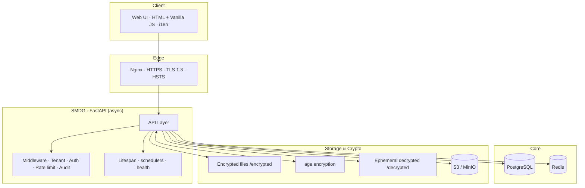

**English** | [Русский](README.ru.md) | [Deutsch](README.de.md) | [Français](README.fr.md)

<div align="center">

# 🔐 SMDG — Secure Medical Data Gateway

**A self-hosted, zero-trust platform for end-to-end encrypted medical file exchange — built to production standards.**


</div>

---

## Why this project exists

Healthcare data is among the most sensitive — and most regulated — data on earth. SMDG lets doctors, clinics and patients exchange medical files (including DICOM imaging) **without ever trusting the network, the client, or the storage layer**. Every file is encrypted server-side with [age](https://age-encryption.org/), shared through time-limited one-shot links, and recorded in a tamper-evident audit trail. A built-in DICOM viewer renders studies in the browser **without shipping decrypted data to the client**.

It is engineered the way a real medical product has to be: **multi-tenant, observable, resilient, horizontally scalable, and compliant (FZ-152 / GDPR / HIPAA-oriented).**

> This repository doubles as an engineering portfolio: it demonstrates end-to-end ownership of a secure, async Python backend — from cryptography and multi-tenancy to CI/CD, SRE resilience patterns, and a full security-scanning pipeline.

---

## What it demonstrates (skills at a glance)

| Domain | In this codebase |
|---|---|
| **Backend (senior)** | Async FastAPI, SQLAlchemy 2.0 async + SQLModel, PostgreSQL (asyncpg), Alembic **zero-downtime** migrations, Redis-backed sessions/cache/queue |
| **Security / AppSec** | `age` encryption at rest, Argon2 + bcrypt, JWT, TOTP 2FA, TLS 1.3 + HSTS, one-shot signed links, full audit logging, secrets management |
| **Multi-tenancy** | Shared-DB isolation by `tenant_id`, subdomain-based tenant resolution, cross-tenant access guards, `super_admin` escape hatch |
| **Reliability / SRE** | Circuit breaker, bulkhead, timeouts, rate limiting, dead-letter queue, SLA/SLI/SLO tracking, disaster-recovery & load tests |
| **DevOps / Platform** | Docker Compose (prod / scale / demo), Nginx reverse proxy, blue/green & rolling deploys, 10 GitHub Actions workflows |
| **Observability** | Prometheus metrics, OpenTelemetry distributed tracing, health/readiness probes, structured audit export |
| **Domain depth** | DICOM (`pydicom`) in-browser viewer, S3/MinIO object storage, medical-grade compliance templates |

---

## Architecture



**Tenant isolation** is enforced at request time: the tenant is resolved from the `Host` subdomain, the JWT carries `tenant_id`, and every data access checks that the token and the request agree (a mismatch returns `403 Cross-tenant access`).

Full details: [`docs/src/ARCHITECTURE.md`](docs/src/ARCHITECTURE.md) · [`docs/src/MULTI_TENANCY.md`](docs/src/MULTI_TENANCY.md)

---

## Key features

- 🔒 **End-to-end encryption** — files encrypted server-side with `age`; decrypted copies are ephemeral and cleaned up automatically.
- 🔗 **One-shot, time-limited links** — share a file without exposing the store; links expire and self-destruct.
- 🩻 **In-browser DICOM viewer** — render medical imaging without sending decrypted data to the client ([`docs/src/DICOM_VIEWER.md`](docs/src/DICOM_VIEWER.md)).
- 🏢 **Multi-tenant** — one deployment serves many clinics with strict data isolation.
- 🛡️ **2FA (TOTP)**, role-based access, and a complete **audit trail** with export (CSV/JSON).
- ♻️ **Resilience built-in** — circuit breaker, bulkhead, timeouts, dead-letter queue, graceful degradation.
- 📈 **Production observability** — Prometheus + OpenTelemetry tracing, health/readiness endpoints.
- 🌍 **Multilingual** — UI and API docs in English / Русский / Deutsch / Français.

See the full list in [`docs/src/FEATURES.md`](docs/src/FEATURES.md).

---

## Tech stack

**Core:** Python 3.10+, FastAPI, Starlette, Uvicorn, Pydantic v2
**Data:** PostgreSQL (asyncpg), SQLAlchemy 2.0 (async) + SQLModel, Alembic, Redis
**Crypto & auth:** age, Argon2, bcrypt/passlib, PyJWT / python-jose, PyOTP
**Storage:** local FS, S3 / MinIO (aiobotocore, boto3)
**Imaging:** pydicom (+ GDCM), Pillow, NumPy
**Ops:** Docker Compose, Nginx, Prometheus, OpenTelemetry, APScheduler
**Quality:** pytest (+asyncio, cov), Ruff, Bandit, factory-boy, respx

---

## Quality & security engineering

- ✅ **60+ test modules** spanning unit, API, integration, security, replication, SLA/SLI/SLO, tracing and disaster-recovery scenarios ([`tests/`](tests/)).
- 🔁 **10 GitHub Actions workflows**: CI, security scanning, load testing, disaster-recovery drills, docs i18n, rolling/blue-green deploys ([`.github/workflows/`](.github/workflows/)).
- 🔬 **Defense-in-depth security pipeline** — SAST (Bandit, Semgrep, SonarQube), SCA (Safety, Snyk), secrets (Gitleaks, TruffleHog), container (Trivy, Grype) and DAST (OWASP ZAP, Nuclei). Modes auto-switch per event (`balanced` / `strict` / `audit`). See [`docs/src/SECURITY.md`](docs/src/SECURITY.md).
- 📊 **Load-tested baseline** documented in [`docs/load-testing.md`](docs/load-testing.md).

---

## Quick start

```bash
git clone <your-repo>
cd smdg
cp .env.example .env
docker compose up --build
```

Open <https://localhost>. Default dev credentials: `admin` / `admin` — **change them immediately.**

### Deployment profiles

`DEPLOYMENT_TYPE` selects the feature matrix:

| Profile | Summary |
|---|---|
| `russia` | FZ-152 compliant: local storage, mandatory 2FA, 3-year audit |
| `intl` | S3/MinIO, DICOM, GDPR/HIPAA-oriented features |
| `single` | Single tenant, simplified admin, local disk |
| `saas` | Multi-tenant, billing / white-label, object storage |
| `demo` | Public showcase: small upload cap, 24h data reset |

CI/CD pushes to a VPS via [`deploy-primary.yml`](.github/workflows/deploy-primary.yml); rolling updates via [`deploy-rolling.yml`](.github/workflows/deploy-rolling.yml). Horizontal scaling (stateless Redis-backed cluster, Nginx LB, blue/green cutover) and rollback runbooks are in [`docs/src/DEPLOYMENT.md`](docs/src/DEPLOYMENT.md) and [`docs/runbooks/rollback-to-baseline.md`](docs/runbooks/rollback-to-baseline.md).

---

## Screenshots & demo

<!--
  Add 2–4 screenshots / a short GIF here to maximize impact for reviewers:
  - login + 2FA screen
  - file upload & one-shot link creation
  - DICOM viewer rendering a study
  - admin audit dashboard
  Drop images under docs/assets/ and reference them:
  

  Optional: deploy the `demo` profile somewhere public and link it here:
  **Live demo:** https://your-demo-url
-->

> 📸 Screenshots and a live demo (`demo` profile) can be added under `docs/assets/`.

---

## Documentation

| Topic | Link |
|---|---|
| Overview | [`docs/src/README.md`](docs/src/README.md) |
| Architecture | [`docs/src/ARCHITECTURE.md`](docs/src/ARCHITECTURE.md) |
| API guide | [`docs/src/API_GUIDE.md`](docs/src/API_GUIDE.md) |
| Features | [`docs/src/FEATURES.md`](docs/src/FEATURES.md) |
| Deployment | [`docs/src/DEPLOYMENT.md`](docs/src/DEPLOYMENT.md) |
| Security policy | [`docs/src/SECURITY.md`](docs/src/SECURITY.md) |
| Multi-tenancy | [`docs/src/MULTI_TENANCY.md`](docs/src/MULTI_TENANCY.md) |
| DICOM viewer | [`docs/src/DICOM_VIEWER.md`](docs/src/DICOM_VIEWER.md) |
| Testing | [`docs/src/TESTING.md`](docs/src/TESTING.md) |
| Compliance template | [`docs/src/COMPLIANCE_TEMPLATE.md`](docs/src/COMPLIANCE_TEMPLATE.md) |

API docs are served live at `/docs` (and `/docs/ru`, `/docs/de`, `/docs/fr`).

---

## About the author

Built and maintained by **Valeriy Popov** — backend & secure-systems engineer focused on **healthcare, security and compliance-heavy systems** (FastAPI, async Python, Postgres, Docker, SRE).

- 📫 valera7623@gmail.com
<!-- Add your professional links to strengthen the portfolio:
- 💼 LinkedIn: https://linkedin.com/in/your-handle
- 🧑‍💻 GitHub: https://github.com/your-handle
- 🌐 Portfolio / Upwork: https://...
-->

*Open to freelance and remote opportunities in secure backend / healthtech engineering.*

---

## License

[MIT](LICENSE) © Valeriy Popov
