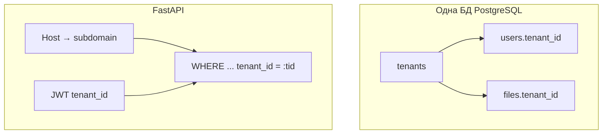

# Multi-tenancy в SMDG

**Версия:** 1.0  
**Дата:** 18 апреля 2026

Руководство описывает, как в проекте устроена **изоляция арендаторов (tenants)**: определение контекста, изоляция данных, настройка, тестирование и известные ограничения.

---
## 0. Быстрый старт за 5 минут

1. **Добавить tenant в БД:**
   ```sql
   INSERT INTO tenants (subdomain, name) VALUES ('clinic1', 'Первая клиника');

   Настроить DNS (или /etc/hosts для локальной разработки):
   127.0.0.1 clinic1.localhost
    
   Зарегистрировать пользователя:
   curl -H "Host: clinic1.localhost" -X POST https://127.0.0.1/api/auth/register \
     -H "Content-Type: application/json" \
     -d '{"username": "doctor", "password": "securepass"}'


## 1. Стратегия

| Подход                                     | Используется в SMDG? |
|--------------------------------------------|----------------------|
| Database per tenant                        | Нет                  |
| Schema per tenant                          | Нет                  |
| **Shared database, row-level `tenant_id`** | **Да**               |

Все арендаторы используют **одну** базу PostgreSQL. Таблица `tenants` хранит метаданные; сущности `users` и `files` ссылаются на `tenants.id` через `tenant_id`. Данные изолированы **логикой запросов** (фильтрация по `tenant_id`) и проверкой JWT.

**Файловое хранилище** (локальная ФС или S3) **не разделено по арендаторам**: объекты не привязаны к отдельному бакету на tenant; доступ к файлам контролируется через строки в БД (`File.tenant_id`) и контекст запроса.



Примеры поддоменов:

clinic1.example.com → tenant: clinic1
clinic2.example.com → tenant: clinic2
admin.example.com → может требовать super_admin (если настроено)

---

## 2. Как определяется текущий tenant

1. **Заголовок HTTP `Host`** передаётся в `resolve_tenant_by_host()` (`app/core/tenant.py`).
2. Из хоста извлекается **первый лейбл поддомена** (`extract_subdomain`): для `clinic.example.com` это `clinic`. Требуется минимум три сегмента имени (`часть1.часть2.часть3`).
3. По значению поддомена выполняется выборка `Tenant.subdomain == subdomain`.
4. **Особые случаи:**
   - `localhost`, `127.0.0.1`, `::1`, `0.0.0.0` без поддомена: если `tenant_resolve_localhost_as_default=true`, подставляется поддомен из настройки `tenant_default_subdomain` (по умолчанию `default`).
   - В режиме разработки (`dev_mode`) пустой host может быть отнесён к тому же резервному поддомену.

Результат кладётся в `request.state.tenant` и `request.scope["tenant"]` в middleware **`set_user_context`** в `app/main.py` (до rate limit и audit).

**JWT** после логина содержит поле **`tenant_id`**. Для защищённых операций вызывается **`assert_tenant_access`**: `tenant_id` из токена должен совпадать с id tenant, разрешённого по `Host`, **если только** роль не `super_admin` (тогда перекрёстная проверка пропускается).

Итоговое правило: клиент должен обращаться к **тому же виртуальному хосту (поддомену)**, под который выдан сеанс, иначе получит **403 Cross-tenant access** (или **400**, если tenant по Host не найден).

---

## 3. Изоляция данных

| Сущность  | Колонка                 | Поведение                              |
|-----------|-------------------------|----------------------------------------|
| `tenants` | —                       | Справочник арендаторов                 |
| `users`   | `tenant_id` NOT NULL FK | Пользователь принадлежит одному tenant |
| `files`   | `tenant_id` NOT NULL FK | Файл принадлежит одному tenant         |

Эндпоинты, работающие с пользователями и файлами, добавляют условия вида `User.tenant_id == tenant.id` / `File.tenant_id == tenant.id` и вызывают `require_tenant(request)` там, где нужен контекст.

**Роль `super_admin`:** обходит проверку `assert_tenant_access` (может работать с данными при «чужом» поддомене в зависимости от сценария — используйте осознанно).

**Скачивание по публичной ссылке** также учитывает tenant: разрешение файла проверяется в контексте tenant, полученного из `Host`.

---

## 4. Middleware и вспомогательные функции

| Компонент              | Файл                     | Назначение                                                                                        |
|------------------------|--------------------------|---------------------------------------------------------------------------------------------------|
| `set_user_context`     | `app/main.py`            | Разрешает tenant по `Host`, парсит JWT из cookie `access_token`, заполняет `request.state` и `request.scope` |
| `require_tenant`       | `app/core/tenant.py`     | Возвращает `Tenant` или 400, если поддомен не сопоставлен записи                                  |
| `assert_tenant_access` | `app/core/tenant.py`     | Сверяет `tenant_id` пользователя с tenant запроса; исключение для `super_admin`                   |
| `AuditMiddleware`      | `app/core/middleware.py` | Аудит (не привязан к tenant в явном виде)                                                         |

Отдельного FastAPI dependency «только для tenant» нет: арендатор передаётся через **`Request`**.

---

## 5. Переменные окружения

Задаются в `.env` / Docker (регистр имён не важен для Pydantic Settings):

| Переменная                            | По умолчанию | Описание                                                                                             |
|---------------------------------------|--------------|------------------------------------------------------------------------------------------------------|
| `TENANT_DEFAULT_SUBDOMAIN`            | `default`    | Поддомен, который подставляется для `localhost` / `127.0.0.1` и аналогов, когда в `Host` нет лейбла поддомена |
| `TENANT_RESOLVE_LOCALHOST_AS_DEFAULT` | `true`       | Включить подстановку резервного поддомена для локальных хостов                                       |
| `DEV_MODE`                            | —            | Влияет на обработку пустого Host (см. `resolve_tenant_by_host`)                                      |

Переменных вида «список разрешённых tenant» в конфиге **нет**: список арендаторов задаётся **данными в таблице `tenants`**.

---

## 6. Как добавить нового tenant

1. **DNS и reverse proxy:** настройте поддомен вида `{subdomain}.ваш-домен`, указывающий на тот же инстанс SMDG (как и для существующих клиентов).
2. **Запись в БД:** вставьте строку в `tenants` (уникальный `subdomain`, human-readable `name`, при необходимости `settings` в JSON).
3. **Пользователи:** создавайте учётные записи **уже в контексте этого tenant** (через API регистрации/админки с заголовком `Host`, соответствующим новому поддомену), либо проставьте `tenant_id` при ручном заведении в БД согласованно с политикой безопасности.
4. **Логин:** пользователь должен открывать приложение по **правильному хосту**, чтобы `resolve_tenant_by_host` нашёл нужный `Tenant` и выдал JWT с корректным `tenant_id`.

Пример SQL (идентификатор `id` подставьте по соглашению с вашей последовательностью):

```sql
INSERT INTO tenants (name, subdomain, settings)
VALUES ('Клиника А', 'clinic-a', '{}'::jsonb);
```

---

## 7. Как тестировать разных арендаторов

**Автотесты:** в `tests/conftest.py` создаётся tenant с `id=1`, `subdomain='default'`. Юнит-тесты для `assert_tenant_access` — в `tests/test_core/test_tenant.py`.

**Ручные / интеграционные запросы:**

- Укажите заголовок **`Host`** в клиенте (например `curl -H "Host: clinic-a.example.com" https://127.0.0.1/api/...` при локальной отладке с `-k`).
- Либо используйте реальные записи в `/etc/hosts` или отдельные поддомены в DNS.
- После логина пройдите сценарий под тем же хостом, что и при выдаче cookie/JWT.

**Важно:** просто менять JWT между запросами без согласованного `Host` приведёт к отказу в доступе для ролей, отличных от `super_admin`.

---

## 8. Миграции БД

Ключевая ревизия Alembic: `migrations/versions/b7c8d9e0f1a2_add_multi_tenant_core.py` (`add multi tenant core`).

Последовательность `upgrade`:

1. Создаётся таблица `tenants` и запись **Default Tenant** с `subdomain = 'default'`.
2. В `users` и `files` добавляется nullable `tenant_id`.
3. Данные заполняются: пользователи — tenant `default`; файлы — по `user_id` или default.
4. Вешаются внешние ключи и индексы; `tenant_id` становится NOT NULL.

При **downgrade** таблица `tenants` и колонки `tenant_id` удаляются — выполняйте только в осознанном сценарии отката.

На старте контейнера миграции обычно применяет `entrypoint.sh` (как и прочие ревизии).

---

## 9. Примеры (curl)

**Имитация tenant `clinic` на локальном сервере (нужна запись в `tenants`):**

```bash
curl -k -H "Host: clinic.localhost" \
  -X POST "https://127.0.0.1/api/auth/login" \
  -H "Content-Type: application/x-www-form-urlencoded" \
  -d "username=demo&password=******"
```

Дальнейшие запросы с той же cookie/JWT должны использовать **тот же `Host`**, что согласован с поддоменом `clinic`.

**Доступ к default-tenant с машины без поддомена в имени:**

```bash
curl -k "https://localhost/api/health"
```

При `TENANT_RESOLVE_LOCALHOST_AS_DEFAULT=true` это соответствует tenant с поддоменом `default`.

---

## 10. Известные ограничения

1. **Глобальная уникальность логина:** в модели `User` поля `username` и `email` помечены как `unique=True` на таблице — то есть **два разных tenant не могут иметь одинаковый username/email** без смены схемы БД. Это ограничение продуктовое/модельное, не только runtime.
2. **Хранилище файлов:** нет физического разделения путей/бакетов по tenant; полагайтесь на корректность `tenant_id` и настроек доступа.
3. **Агрегированная статистика** (`/api/stats`): доступ проверяется по tenant, но часть метрик (хост, диск, список объектов в storage) отражает **инстанс целиком**, а не одного арендатора.
4. **Продакшен без поддомена:** если запрос приходит на «плоский» хост без трёх сегментов DNS и это не localhost, tenant может **не определиться** (`400 Tenant could not be resolved from subdomain`). Нужна схема DNS с поддоменами или выделенные хостнеймы по политике продукта.
5. **`super_admin`:** обход проверки cross-tenant снимает часть гарантий изоляции — ограничивайте эту роль.

---

## 11. Связанные файлы кода

| Файл                                       | Роль                                                                                    |
|--------------------------------------------|-----------------------------------------------------------------------------------------|
| `app/core/tenant.py`                       | Резолвинг tenant, `require_tenant`, `assert_tenant_access`                              |
| `app/main.py`                              | Middleware контекста, первичное создание default tenant при инициализации admin         |
| `app/core/auth_utils.py`                   | JWT с `tenant_id`                                                                       |
| `app/models/tenant.py`                     | Модель `Tenant`                                                                         |
| `app/models/user.py`, `app/models/file.py` | `tenant_id`                                                                             |

Подробности по архитектуре: [../ARCHITECTURE.md](../ARCHITECTURE.md).

12. Частые проблемы и решения (Troubleshooting)

|Проблема	                                   |Вероятная причина	                            Решение
|----------------------------------------------|---------------------------------------------|--------------------------------------------------------------------
|403 Cross-tenant access	                   | Host не совпадает с tenant_id в JWT	     |   Проверьте Host заголовок при логине и запросах. Убедитесь,чтоиспользуете тот же поддомен
|----------------------------------------------|---------------------------------------------|--------------------------------------------------------------------
|400 Tenant could not be resolved	           | Поддомен не найден в таблице tenants	     |   Проверьте DNS и записи в БД tenants. Убедитесь, что поддомен имеет минимум 3 сегмента
|----------------------------------------------|---------------------------------------------|--------------------------------------------------------------------
|Данные видны не из своего tenant	           | Баг в запросе к БД	                         |   Убедитесь, что везде добавлен .filter_by(tenant_id=tenant.id) или аналогичный фильтр
|----------------------------------------------|---------------------------------------------|--------------------------------------------------------------------
|Не работает на localhost	                   | TENANT_RESOLVE_LOCALHOST_AS_DEFAULT=false	 |   Установите в true в .env или явно указывайте Host: -H "Host: clinic.localhost"
|----------------------------------------------|---------------------------------------------|--------------------------------------------------------------------
|JWT есть, но tenant не определяется	       | Middleware не выполнился	                 |   Проверьте порядок middleware в app/main.py. set_user_context должен быть рано
|----------------------------------------------|---------------------------------------------|--------------------------------------------------------------------
|После миграции старые данные стали недоступны | У старых записей нет tenant_id	             |   Убедитесь, что миграция проставила default tenant для       существующих записей
|_________________________________________________________________________________________________________________________________________________________________

13. Мониторинг и отладка

Полезные SQL запросы:

-- Сколько пользователей в каждом tenant
SELECT t.subdomain, COUNT(u.id) 
FROM tenants t 
LEFT JOIN users u ON u.tenant_id = t.id 
GROUP BY t.id;

-- Найти "потерянные" записи без tenant
SELECT * FROM users WHERE tenant_id IS NULL;
SELECT * FROM files WHERE tenant_id IS NULL;

-- Активность по tenant'ам за последний час
SELECT t.subdomain, COUNT(a.id) 
FROM tenants t 
LEFT JOIN audit_logs a ON a.tenant_id = t.id AND a.created_at > NOW() - INTERVAL '1 hour'
GROUP BY t.id;

Логирование:

При включении LOG_LEVEL=DEBUG middleware логирует:

Resolved tenant from host: {subdomain} -> {tenant_id}
Tenant access check: user {user_id} -> tenant {tenant_id} (allowed/denied)
Cross-tenant access attempt blocked: user from {jwt_tenant_id} tried to access {request_tenant_id}

Метрики для мониторинга (Prometheus):

# Количество активных tenant'ов
smdg_tenants_active

# Запросы с ошибками cross-tenant
smdg_cross_tenant_denied_total

# Распределение запросов по tenant'ам
smdg_requests_by_tenant{tenant="clinic1"}

14. Чеклист для разработчика при добавлении нового эндпоинта

Эндпоинт использует require_tenant(request) или получает tenant из request.state.tenant?

Запрос к БД фильтрует по tenant_id? (Никогда не делайте SELECT * FROM users без tenant фильтра)

При создании объекта проставляется tenant_id = tenant.id?

Для супер-админов есть явная проверка роли, если нужен доступ ко всем tenant'ам?

В тестах есть кейс с cross-tenant доступом (ожидается 403)?

Эндпоинт не возвращает данные из tenants других tenant'ов?

Обновлена документация API (если менялся публичный интерфейс)?

Пример правильной реализации эндпоинта:

@router.get("/users")
async def get_users(request: Request, db: Session = Depends(get_db)):
    tenant = require_tenant(request)  # получаем tenant
    
    users = db.query(User).filter(
        User.tenant_id == tenant.id  # обязательно фильтруем!
    ).all()
    
    return users

❌ Неправильно (утечка данных):

@router.get("/users")
async def get_users(db: Session = Depends(get_db)):
    users = db.query(User).all()  # ОПАСНО! Вернёт пользователей всех tenant'ов
    return users

15. План миграции для существующего проекта
Если вы внедряете multi-tenancy в уже работающий проект:

Подготовка:
Создайте бэкап БД
Добавьте колонку tenant_id как nullable
Создайте таблицу tenants
Создание default tenant:
INSERT INTO tenants (id, subdomain, name) VALUES (1, 'default', 'Default Tenant');

Заполнение существующих данных:
UPDATE users SET tenant_id = 1 WHERE tenant_id IS NULL;
UPDATE files SET tenant_id = 1 WHERE tenant_id IS NULL;

Сделайте tenant_id NOT NULL:
ALTER TABLE users ALTER COLUMN tenant_id SET NOT NULL;
ALTER TABLE files ALTER COLUMN tenant_id SET NOT NULL;

Добавьте внешние ключи и индексы

Обновите код:
Добавьте middleware
Обновите все запросы к БД
Добавьте проверки tenant в эндпоинты

Тестирование:
Проверьте, что старые пользователи могут войти (через default поддомен)
Создайте нового tenant и проверьте изоляцию

Production rollout:
Разверните с TENANT_STRICT_MODE=false
Убедитесь, что всё работает
Включите TENANT_STRICT_MODE=true


