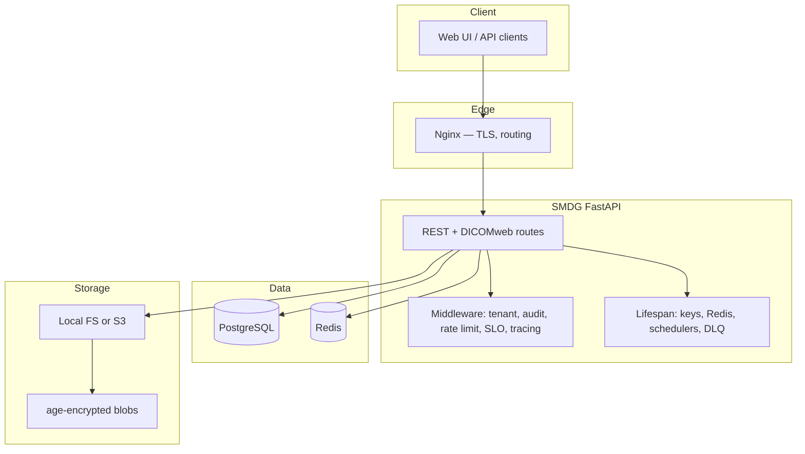

# Architecture

SMDG architecture overview for developers.

## Overview

SMDG is a self-hosted medical file exchange system with **end-to-end encryption** (age), time-limited links, audit logging and optional DICOMweb.

## High-level diagram

## Application layers

| Layer | Path | Responsibility |
|-------|------|----------------|
| API | `app/api/` | Upload, download, auth, admin, DICOMweb, health |
| Core | `app/core/` | Config, storage, security, middleware, tracing |
| Services | `app/services/` | Webhooks, archive, DLQ, email/Telegram |
| Models | `app/models/` | SQLModel entities |

## Upload flow

1. `POST /api/upload` (authenticated, tenant-scoped).
2. MIME/size validation.
3. age encryption → `StorageBackend`.
4. Metadata in PostgreSQL + audit event.

## Download flow

1. Authorised `GET /api/download/{id}` or public link.
2. Read ciphertext from storage.
3. age decryption → stream to client.
4. Audit `file.downloaded`.

## Scaling

- Horizontal scaling behind Nginx load balancer.
- Shared PostgreSQL + Redis + S3.
- Stateless FastAPI workers.

See [src/ARCHITECTURE.md](../src/ARCHITECTURE.md) for full detail.

## Security

- Argon2id passwords, HS256 JWT, TOTP 2FA.
- Docker Secrets in production.
- Rate limiting (slowapi + Redis).

See [Security](../misc/security.md).
