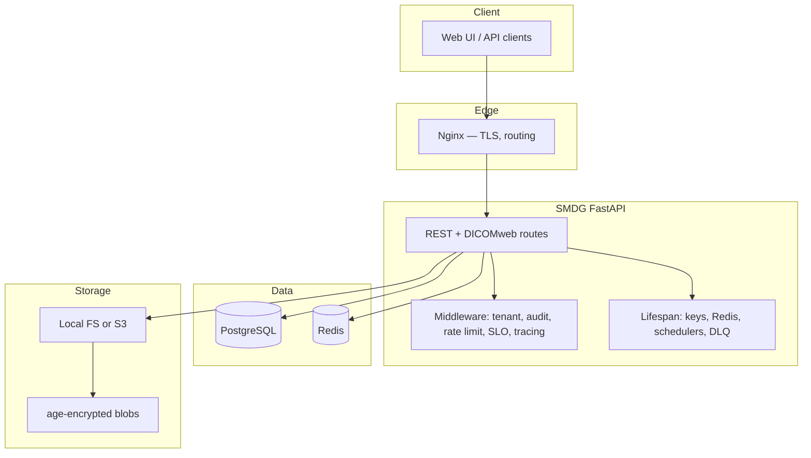

# Архитектура

Обзор архитектуры SMDG для разработчиков.

## Обзор

SMDG — self-hosted система обмена медицинскими файлами с **end-to-end шифрованием** (age), временными ссылками, аудитом и опциональным DICOMweb.

## Высокоуровневая схема

## Слои приложения

| Слой | Каталог | Ответственность |
|------|---------|-----------------|
| API | `app/api/` | Upload, download, auth, admin, DICOMweb, health |
| Core | `app/core/` | Config, storage, security, middleware, tracing |
| Services | `app/services/` | Webhooks, archive, DLQ, email/Telegram |
| Models | `app/models/` | SQLModel entities |

## Поток загрузки

1. `POST /api/upload` (authenticated, tenant-scoped).
2. Валидация MIME/размера.
3. Шифрование age → `StorageBackend`.
4. Метаданные в PostgreSQL + audit event.

## Поток скачивания

1. Авторизованный `GET /api/download/{id}` или публичная ссылка.
2. Чтение ciphertext из storage.
3. Расшифровка age → stream клиенту.
4. Audit `file.downloaded`.

## Масштабирование

- Горизонтальное масштабирование за Nginx load balancer.
- Shared PostgreSQL + Redis + S3.
- Stateless FastAPI workers.

Подробнее: [src/ARCHITECTURE.md](../src/ARCHITECTURE.md).

## Безопасность

- Argon2id для паролей, HS256 JWT, TOTP 2FA.
- Docker Secrets для production.
- Rate limiting (slowapi + Redis).

См. [Безопасность](../misc/security.md).
