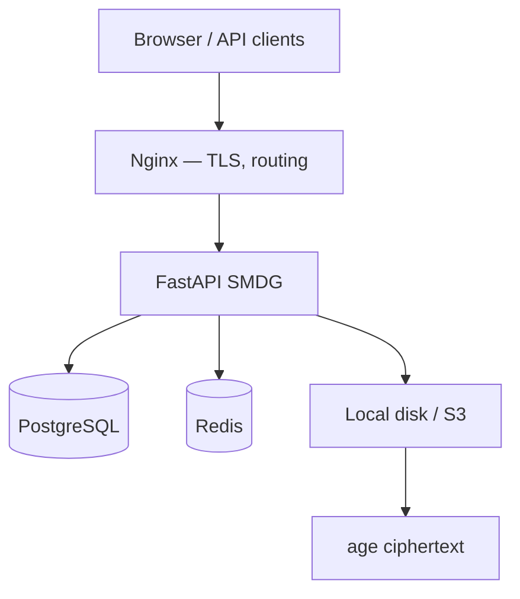

# SMDG Documentation

**SMDG** (Secure Medical Data Gateway) is a self-hosted platform for secure medical file exchange with end-to-end encryption.

**Current version:** **4.0.0** (core and DICOM Viewer); audit export — **3.1.0**.

## Features

- Server-side **age** (X25519) file encryption
- Time-limited one-shot download links
- JWT + HttpOnly cookies, **2FA** (TOTP)
- RBAC: `admin` | `doctor` | `user` | `super_admin`
- Full operations **audit** (JSON + CSV, Excel/PDF export)
- In-browser **DICOM Viewer** (Window/Level, measurements, Cine)
- **DICOMweb** (QIDO-RS, WADO-RS)
- **Webhooks** with HMAC-SHA256
- Storage: local disk or **S3** (MinIO, Yandex, Selectel, AWS)
- **Multi-tenancy** (`saas` profile)
- Deployment profiles: `russia` | `intl` | `single` | `saas` | `demo`

## Navigation

### For users

1. [Getting started](user-guide/getting-started.md) — login, roles, UI
2. [Files](user-guide/files.md) — upload and management
3. [Links and sharing](user-guide/links-and-sharing.md) — one-shot links
4. [DICOM](user-guide/dicom.md) — medical imaging

### For administrators

1. [Deployment](admin-guide/deployment.md)
2. [Configuration](admin-guide/configuration.md)
3. [Backup](admin-guide/backup.md)
4. [Monitoring](admin-guide/monitoring.md)

### For developers

1. [Architecture](developer-guide/architecture.md)
2. [Multi-tenancy](developer-guide/multi-tenancy.md)
3. [API](api/index.md)

## Architecture (overview)

## Demo

Public instance (`demo` profile, data reset every 24 h):

**https://fileguardian.info**

## Version

See `GET /health` and [Changelog](misc/changelog.md).
