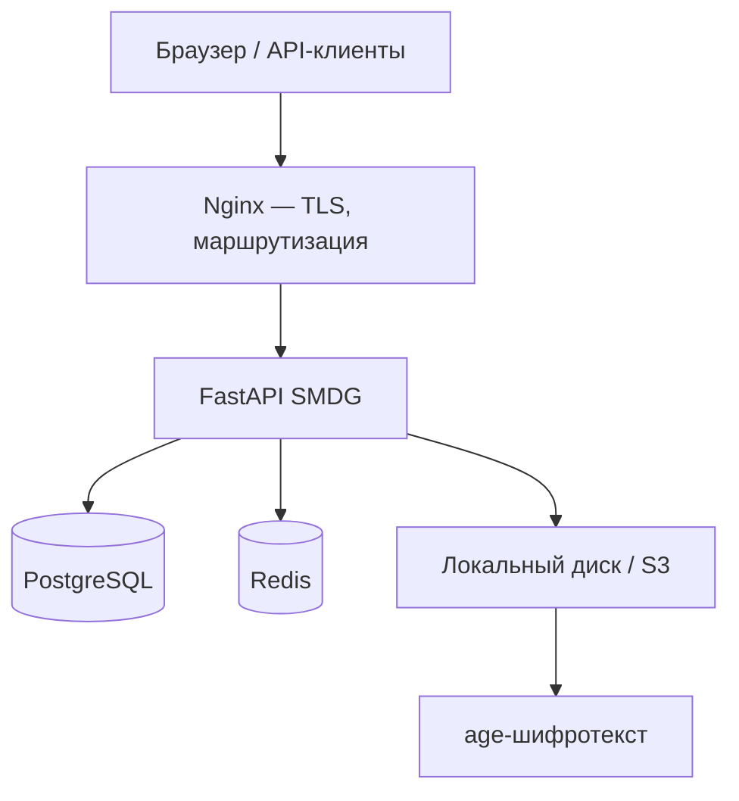

# SMDG — документация

**SMDG** (Secure Medical Data Gateway) — self-hosted платформа для безопасного обмена медицинскими файлами с end-to-end шифрованием.

**Текущая версия:** **4.0.0** (ядро и DICOM Viewer); экспорт аудита — **3.1.0**.

## Возможности

- Шифрование файлов **age** (X25519) на сервере
- Временные одноразовые ссылки на скачивание
- JWT + HttpOnly cookies, **2FA** (TOTP)
- Ролевая модель: `admin` | `doctor` | `user` | `super_admin`
- Полный **аудит** операций (JSON + CSV, экспорт Excel/PDF)
- **DICOM Viewer** в браузере (Window/Level, измерения, Cine)
- **DICOMweb** (QIDO-RS, WADO-RS)
- **Webhooks** с HMAC-SHA256
- Хранилище: локальный диск или **S3** (MinIO, Yandex, Selectel, AWS)
- **Мультитенантность** (профиль `saas`)
- Профили развёртывания: `russia` | `intl` | `single` | `saas` | `demo`

## Навигация

### Для пользователей

1. [Начало работы](user-guide/getting-started.md) — вход, роли, интерфейс
2. [Файлы](user-guide/files.md) — загрузка и управление
3. [Ссылки и обмен](user-guide/links-and-sharing.md) — одноразовые ссылки
4. [DICOM](user-guide/dicom.md) — просмотр снимков

### Для администраторов

1. [Деплой](admin-guide/deployment.md)
2. [Конфигурация](admin-guide/configuration.md)
3. [Резервное копирование](admin-guide/backup.md)
4. [Мониторинг](admin-guide/monitoring.md)

### Для разработчиков

1. [Архитектура](developer-guide/architecture.md)
2. [Мультитенантность](developer-guide/multi-tenancy.md)
3. [API](api/index.md)

## Архитектура (кратко)

## Демо

Публичный инстанс (профиль `demo`, данные сбрасываются раз в 24 ч):

**https://fileguardian.info**

## Версия

См. `GET /health` и [Changelog](misc/changelog.md).
