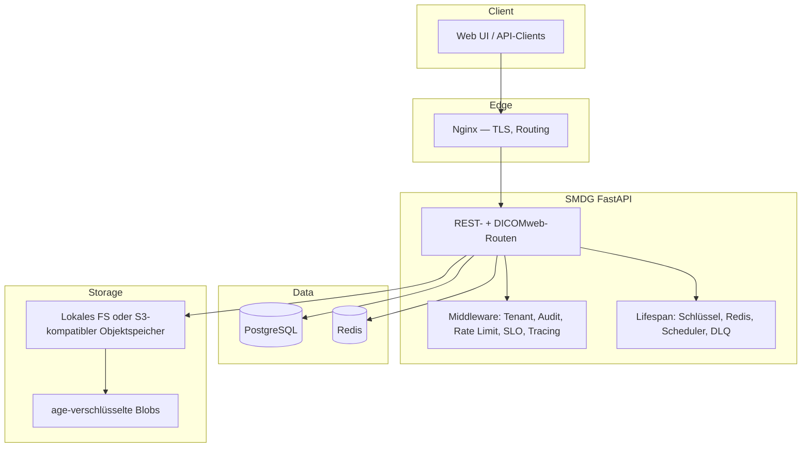

<!-- smdg-i18n-header-start
source: docs/src/ARCHITECTURE.md
source_sha1: 112033e9d39e57481a89dea28fc98832e235c658
language: de
last_sync: 2026-05-31
status: translated
smdg-i18n-header-end -->

# SMDG-Architektur

**Version:** 1.1 (abgeglichen mit der russischen Quelle [`docs/locales/ru/ARCHITECTURE.md`](../ru/ARCHITECTURE.md))  
**Datum:** 2026-04-18

Dieses Dokument ist der englischsprachige operative Überblick. Die russische
Ausgabe bleibt die ausführlichste Referenz für erweiterte Diagramme und
historische Anmerkungen.

---

## 1. Überblick

SMDG (Secure Medical Data Gateway) ist ein **selbst gehostetes** System zum
Austausch medizinischer Dateien mit **Ende-zu-Ende-Verschlüsselung** (age),
**zeitlich begrenzten Links**, **Audit-Protokollierung** und optionaler
**DICOMweb**-Auslieferung an einen Viewer im Browser.

Designziele:

- Vertraulichkeit und Integrität medizinischer Nutzdaten  
- Vollständiger Audit-Trail für Operator- und API-Aktionen  
- Ausrichtung an FZ-152-ähnlichen und DSGVO-orientierten Bereitstellungsprofilen  
- Asynchrone E/A (FastAPI + SQLAlchemy 2 async) und horizontale Skalierung hinter einem Load Balancer  
- Produktionsreife: Health/Readiness, Prometheus-Metriken, OpenTelemetry, Security-CI

---

## 2. Architektur auf hoher Ebene

### 2.1 Mandantenfähigkeit

Das Standardmodell verwendet eine **gemeinsame Datenbank**: `tenant_id`
begrenzt `User`- und `File`-Zeilen. Der aktive Tenant wird aus der
**`Host`-Subdomain** (und zugehörigen Headern) aufgelöst; JWTs tragen
`tenant_id`. Zugriffsprüfungen erzwingen die Tenant-Grenzen; `super_admin`
darf Tenants überschreiten, sofern die Richtlinie es erlaubt. Der
Dateispeicher (Festplatte oder gemeinsamer Bucket) ist **logisch** durch
Anwendungsregeln und Metadaten partitioniert, nicht durch separate Datenbanken
pro Tenant.

---

## 3. Hauptkomponenten

| Schicht | Verantwortung |
|---------|---------------|
| **API** (`app/api/`) | Upload, Download, Links, Auth, Admin, DICOMweb, Health, SLO/SLI |
| **Core** (`app/core/`) | Konfiguration, Storage-Backends, Krypto-Hooks, Middleware, Ratenbegrenzung, Sessions (Redis), Job-Queue, Tracing |
| **Services** (`app/services/`) | Archiv, Dead-Letter-Queue, Webhooks, Datei-Zugriffs-Audit, E-Mail-/Telegram-Benachrichtigungen, CDN |
| **Models** (`app/models/`) | SQLModel/SQLAlchemy-Entitäten (Tenant, User, File, File-Links, DICOM-View-Tokens, Webhooks, Datei-Zugriffsereignisse, Archiv, Dead-Letter, gelöschte Benutzer) |

Laufzeitabhängigkeiten: **PostgreSQL** (maßgebliche Metadaten), **Redis**
(Ratenlimits, optional Sessions/Cache/Queues im skalierten Modus),
**Objektspeicher oder lokale Pfade** für den Chiffretext.

---

## 4. Datenbankentitäten (Zusammenfassung)

Kernbeziehungen:

- `Tenant` 1—* `User`; `Tenant` 1—* `File`  
- `User` 1—* `File`; `File` 1—* `FileLink` (Einmal- oder begrenzte Download-Links)  
- `File` 1—* `DicomViewToken` (Viewer-Sitzungen)

Indizes und Constraints folgen der Nutzung in Auflistungs-, Audit- und
Tenant-bezogenen Abfragen (siehe Alembic-Migrationen unter `migrations/`).

---

## 5. Anfrageabläufe (konzeptionell)

### 5.1 Upload

1. Der Client sendet `POST /api/upload` (authentifiziert, Tenant-bezogen).  
2. Middleware erfasst den Audit-Kontext; optionale Bulkheads/Timeouts greifen.  
3. Die Nutzlast wird validiert (Größe, MIME, Erweiterung).  
4. Der Inhalt wird mit **age** verschlüsselt; der Chiffretext wird über `StorageBackend` (FS oder S3) geschrieben.  
5. Metadaten werden in PostgreSQL gespeichert; ein Audit-Ereignis wird geschrieben.  
6. Die Antwort liefert Bezeichner und link-bezogene Daten gemäß Richtlinie.

### 5.2 Download / Freigabe

1. Authentifizierter oder token-basierter Zugriff gemäß `FileLink` oder Richtlinie.  
2. Lesen aus dem Speicher → Entschlüsselung in kontrollierten Pfaden (Streaming, wo zutreffend).  
3. Audit-Ereignis für erfolgreichen oder fehlgeschlagenen Zugriff.

### 5.3 DICOM-Viewer

Die DICOM-Endpunkte (`app/api/dicom.py`) implementieren **DICOMweb-artige**
QIDO/WADO-Muster hinter **View-Tokens**. Der Chiffretext wird **im
Arbeitsspeicher** zum Parsen/Ausliefern entschlüsselt; Tokens sind kurzlebig
und auditierbar. OHIF-kompatible Clients verarbeiten JSON- und Frame-Nutzlasten,
ohne langlebige Geheimnisse zu erhalten.

---

## 6. Sicherheitsgrenzen

- **Transport:** TLS am Edge (Nginx oder gleichwertig).  
- **Authentifizierung:** JWT in HttpOnly-Cookies (und Bearer, wo dokumentiert); Argon2-Passwort-Hashing.  
- **Verschlüsselung im Ruhezustand:** age pro Datei; Schlüssel verwaltet über `keys/` oder bereitstellungsspezifische KMS-Muster.  
- **Observability:** keine personenbezogenen Daten in Metrik-Labels; Trace-IDs zur Korrelation verwenden.

Zur Bedrohungsmodellierung und zu CVE-Hinweisen für Abhängigkeiten siehe
[`docs/src/SECURITY.md`](SECURITY.md).

---

## 7. Bereitstellungsprofile

`DEPLOYMENT_TYPE` wählt Funktionskombinationen (`russia`, `intl`, `single`,
`saas`, `demo`). Das `demo`-Profil ist eine Variante für öffentliche
Vorführungen (lokaler Speicher, optionale 2FA, kleines Upload-Limit,
automatischer Daten-Reset). Die zustandslose Skalierung nutzt Redis für
gemeinsamen Session-/Cache-/Queue-Zustand und einen gemeinsamen Objektspeicher
— siehe [`docs/src/DEPLOYMENT.md`](DEPLOYMENT.md).

**Python-Laufzeit:** Produktions-Docker-Images verwenden **Python 3.10**; die
CI testet gegen 3.10–3.12.

---

## 8. Verwandte Dokumentation

- API: [`docs/src/API_GUIDE.md`](API_GUIDE.md)  
- Bereitstellung: [`docs/src/DEPLOYMENT.md`](DEPLOYMENT.md)  
- DICOM-Viewer: [`docs/src/DICOM_VIEWER.md`](DICOM_VIEWER.md)  
- Sicherheit: [`docs/src/SECURITY.md`](SECURITY.md)  
- Erweiterte russische Architektur: [`docs/locales/ru/ARCHITECTURE.md`](../ru/ARCHITECTURE.md)
