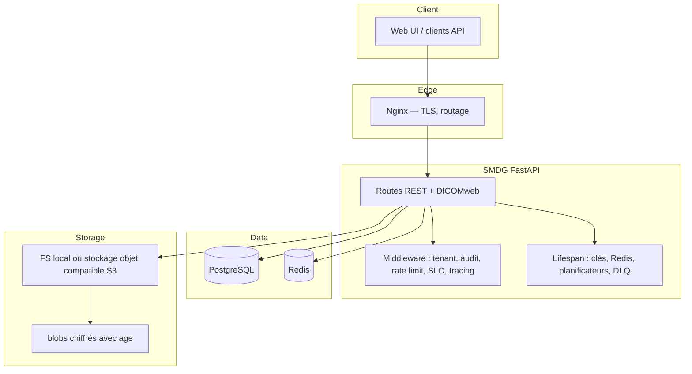

<!-- smdg-i18n-header-start
source: docs/src/ARCHITECTURE.md
source_sha1: 112033e9d39e57481a89dea28fc98832e235c658
language: fr
last_sync: 2026-05-31
status: translated
smdg-i18n-header-end -->

# Architecture SMDG

**Version :** 1.1 (alignée sur la source russe [`docs/locales/ru/ARCHITECTURE.md`](../ru/ARCHITECTURE.md))  
**Date :** 2026-04-18

Ce document est l'aperçu opérationnel en anglais. L'édition russe reste la
référence la plus détaillée pour les diagrammes étendus et les notes
historiques.

---

## 1. Aperçu

SMDG (Secure Medical Data Gateway) est un système **auto-hébergé** pour
l'échange de fichiers médicaux avec **chiffrement de bout en bout** (age),
**liens à durée limitée**, **journalisation d'audit** et livraison **DICOMweb**
optionnelle vers une visionneuse dans le navigateur.

Objectifs de conception :

- Confidentialité et intégrité des charges utiles médicales  
- Piste d'audit complète des actions des opérateurs et de l'API  
- Alignement sur les profils de déploiement de type FZ-152 et orientés RGPD  
- E/S asynchrones (FastAPI + SQLAlchemy 2 async) et mise à l'échelle horizontale derrière un équilibreur de charge  
- Prêt pour la production : health/readiness, métriques Prometheus, OpenTelemetry, CI de sécurité

---

## 2. Architecture de haut niveau

### 2.1 Multi-tenancy

Le modèle par défaut utilise une **base de données partagée** : `tenant_id`
délimite les lignes `User` et `File`. Le tenant actif est résolu à partir de
la **sous-domaine `Host`** (et des en-têtes associés) ; les JWT portent
`tenant_id`. Les contrôles d'accès aux données appliquent les limites de
tenant ; `super_admin` peut franchir les tenants lorsque la politique le
permet. Le stockage des fichiers (disque ou bucket partagé) est partitionné
**logiquement** par les règles applicatives et les métadonnées, et non par des
bases de données séparées par tenant.

---

## 3. Composants principaux

| Couche | Responsabilité |
|--------|----------------|
| **API** (`app/api/`) | Upload, download, liens, auth, admin, DICOMweb, health, SLO/SLI |
| **Core** (`app/core/`) | Configuration, backends de stockage, hooks de chiffrement, middleware, limitation de débit, sessions (Redis), file de tâches, tracing |
| **Services** (`app/services/`) | Archive, file de lettres mortes (DLQ), webhooks, audit des accès aux fichiers, notifications e-mail/Telegram, CDN |
| **Models** (`app/models/`) | Entités SQLModel/SQLAlchemy (tenant, user, file, liens de fichiers, jetons de visualisation DICOM, webhooks, événements d'accès aux fichiers, archive, lettres mortes, utilisateurs supprimés) |

Dépendances à l'exécution : **PostgreSQL** (métadonnées faisant autorité),
**Redis** (limites de débit, sessions/cache/files optionnels en mode mis à
l'échelle), **stockage objet ou chemins locaux** pour le texte chiffré.

---

## 4. Entités de base de données (synthèse)

Relations principales :

- `Tenant` 1—* `User` ; `Tenant` 1—* `File`  
- `User` 1—* `File` ; `File` 1—* `FileLink` (liens de téléchargement à usage unique ou limité)  
- `File` 1—* `DicomViewToken` (sessions de visionneuse)

Les index et contraintes suivent l'usage dans les requêtes de listage, d'audit
et celles délimitées par tenant (voir les migrations Alembic sous
`migrations/`).

---

## 5. Flux de requêtes (conceptuel)

### 5.1 Upload

1. Le client envoie `POST /api/upload` (authentifié, délimité par tenant).  
2. Le middleware enregistre le contexte d'audit ; des bulkheads/timeouts optionnels s'appliquent.  
3. La charge utile est validée (taille, MIME, extension).  
4. Le contenu est chiffré avec **age** ; le texte chiffré est écrit via `StorageBackend` (FS ou S3).  
5. Les métadonnées sont persistées dans PostgreSQL ; un événement d'audit est écrit.  
6. La réponse renvoie les identifiants et les données liées aux liens selon la politique.

### 5.2 Téléchargement / partage

1. Accès authentifié ou basé sur un jeton selon `FileLink` ou la politique.  
2. Lecture du stockage → déchiffrement dans des chemins contrôlés (streaming le cas échéant).  
3. Événement d'audit pour un accès réussi ou échoué.

### 5.3 Visionneuse DICOM

Les points de terminaison DICOM (`app/api/dicom.py`) implémentent des motifs
QIDO/WADO **de style DICOMweb** derrière des **jetons de visualisation**. Le
texte chiffré est déchiffré **en mémoire** pour l'analyse/la diffusion ; les
jetons sont de courte durée et auditables. Les clients compatibles OHIF
consomment des charges utiles JSON et de trames sans recevoir de secrets de
longue durée.

---

## 6. Limites de sécurité

- **Transport :** TLS en périphérie (Nginx ou équivalent).  
- **Authentification :** JWT dans des cookies HttpOnly (et Bearer là où documenté) ; hachage des mots de passe avec Argon2.  
- **Chiffrement au repos :** age par fichier ; clés gérées via `keys/` ou des modèles KMS spécifiques au déploiement.  
- **Observabilité :** éviter les données personnelles dans les étiquettes de métriques ; utiliser les ID de trace pour la corrélation.

Pour la modélisation des menaces et les notes sur les CVE des dépendances,
voir [`docs/src/SECURITY.md`](SECURITY.md).

---

## 7. Profils de déploiement

`DEPLOYMENT_TYPE` sélectionne des combinaisons de fonctionnalités (`russia`,
`intl`, `single`, `saas`, `demo`). Le profil `demo` est une variante de
démonstration publique (stockage local, 2FA facultative, petite limite de
téléversement, réinitialisation automatique des données). La mise à l'échelle
sans état utilise Redis pour l'état partagé session/cache/file et un stockage
objet partagé — voir [`docs/src/DEPLOYMENT.md`](DEPLOYMENT.md).

**Runtime Python :** les images Docker de production utilisent **Python 3.10** ;
la CI teste sur 3.10–3.12.

---

## 8. Documentation associée

- API : [`docs/src/API_GUIDE.md`](API_GUIDE.md)  
- Déploiement : [`docs/src/DEPLOYMENT.md`](DEPLOYMENT.md)  
- Visionneuse DICOM : [`docs/src/DICOM_VIEWER.md`](DICOM_VIEWER.md)  
- Sécurité : [`docs/src/SECURITY.md`](SECURITY.md)  
- Architecture russe étendue : [`docs/locales/ru/ARCHITECTURE.md`](../ru/ARCHITECTURE.md)
