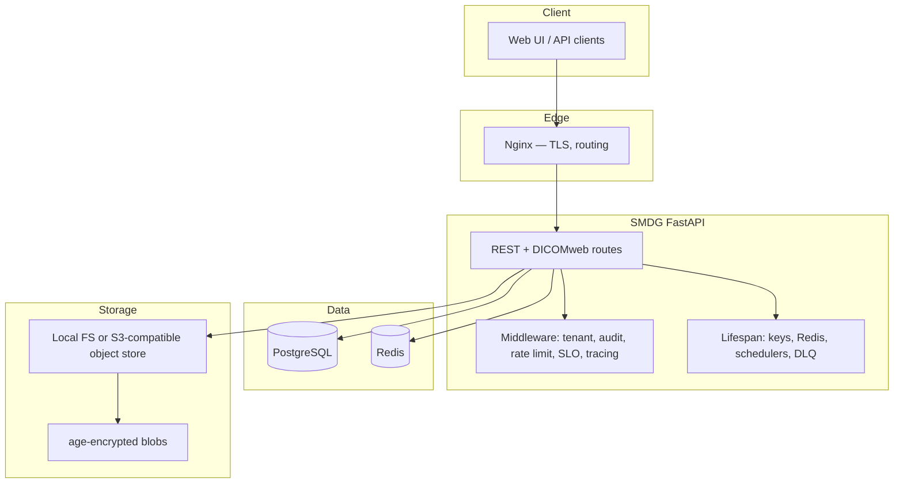

# SMDG Architecture

**Version:** 1.1 (aligned with Russian source [`docs/locales/ru/ARCHITECTURE.md`](../locales/ru/ARCHITECTURE.md))  
**Date:** 2026-04-18

This document is the English operational overview. The Russian edition remains the most detailed reference for extended diagrams and historical notes.

---

## 1. Overview

SMDG (Secure Medical Data Gateway) is a **self-hosted** system for exchanging medical files with **end-to-end encryption** (age), **time-limited links**, **audit logging**, and optional **DICOMweb** delivery to an in-browser viewer.

Design goals:

- Confidentiality and integrity of medical payloads  
- Full audit trail of operator and API actions  
- Alignment with FZ-152-style and GDPR-oriented deployment profiles  
- Async I/O (FastAPI + SQLAlchemy 2 async) and horizontal scaling behind a load balancer  
- Production readiness: health/readiness, Prometheus metrics, OpenTelemetry, security CI

---

## 2. High-level architecture

### 2.1 Multi-tenancy

The default model uses a **shared database**: `tenant_id` scopes `User` and `File` rows. The active tenant is resolved from the **`Host` subdomain** (and related headers); JWTs carry `tenant_id`. Data access checks enforce tenant boundaries; `super_admin` may cross tenants where policy allows. File storage (disk or shared bucket) is **logically** partitioned by application rules and metadata, not by separate DBs per tenant.

---

## 3. Main components

| Layer | Responsibility |
|-------|------------------|
| **API** (`app/api/`) | Upload, download, links, auth, admin, DICOMweb, health, SLO/SLI |
| **Core** (`app/core/`) | Config, storage backends, crypto hooks, middleware, rate limiting, sessions (Redis), job queue, tracing |
| **Services** (`app/services/`) | Archive, DLQ, webhooks, notifications |
| **Models** (`app/models/`) | SQLModel/SQLAlchemy entities (tenant, user, file, links, DICOM view tokens, webhooks) |

Runtime dependencies: **PostgreSQL** (authoritative metadata), **Redis** (rate limits, optional sessions/cache/queues in scaled mode), **object storage or local paths** for ciphertext.

---

## 4. Database entities (summary)

Core relationships:

- `Tenant` 1—* `User`; `Tenant` 1—* `File`  
- `User` 1—* `File`; `File` 1—* `FileLink` (one-shot or limited download links)  
- `File` 1—* `DicomViewToken` (viewer sessions)

Indexes and constraints follow usage in listing, audit, and tenant-scoped queries (see Alembic migrations under `migrations/`).

---

## 5. Request flows (conceptual)

### 5.1 Upload

1. Client sends `POST /api/upload` (authenticated, tenant-scoped).  
2. Middleware records audit context; optional bulkheads/timeouts apply.  
3. Payload is validated (size, MIME, extension).  
4. Content is encrypted with **age**; ciphertext is written via `StorageBackend` (FS or S3).  
5. Metadata is persisted in PostgreSQL; audit event is written.  
6. Response returns identifiers and link-related data per policy.

### 5.2 Download / sharing

1. Authenticated or token-based access according to `FileLink` or policy.  
2. Storage read → decrypt in controlled paths (streaming where applicable).  
3. Audit event for successful or failed access.

### 5.3 DICOM viewer

DICOM endpoints (`app/api/dicom.py`) implement **DICOMweb-style** QIDO/WADO patterns behind **view tokens**. Ciphertext is decrypted **in memory** for parsing/serving; tokens are short-lived and auditable. OHIF-compatible clients consume JSON and frame payloads without receiving long-lived secrets.

---

## 6. Security boundaries

- **Transport:** TLS at the edge (Nginx or equivalent).  
- **Authentication:** JWT in HttpOnly cookies (and Bearer where documented); Argon2 password hashing.  
- **Encryption at rest:** age per file; keys managed via `keys/` or deployment-specific KMS patterns.  
- **Observability:** avoid PII in metric labels; use trace IDs for correlation.

For threat modelling and dependency CVE notes, see [`docs/src/SECURITY.md`](SECURITY.md).

---

## 7. Deployment profiles

`DEPLOYMENT_TYPE` selects feature combinations (`russia`, `intl`, `single`, `saas`). Stateless scaling uses Redis for shared session/cache/queue state and a shared object store—see [`docs/src/DEPLOYMENT.md`](DEPLOYMENT.md).

**Python runtime:** production Docker images use **Python 3.10**; CI tests against 3.10–3.12.

---

## 8. Related documentation

- API: [`docs/src/API_GUIDE.md`](API_GUIDE.md)  
- Deployment: [`docs/src/DEPLOYMENT.md`](DEPLOYMENT.md)  
- DICOM viewer: [`docs/src/DICOM_VIEWER.md`](DICOM_VIEWER.md)  
- Security: [`docs/src/SECURITY.md`](SECURITY.md)  
- Russian extended architecture: [`docs/locales/ru/ARCHITECTURE.md`](../locales/ru/ARCHITECTURE.md)
